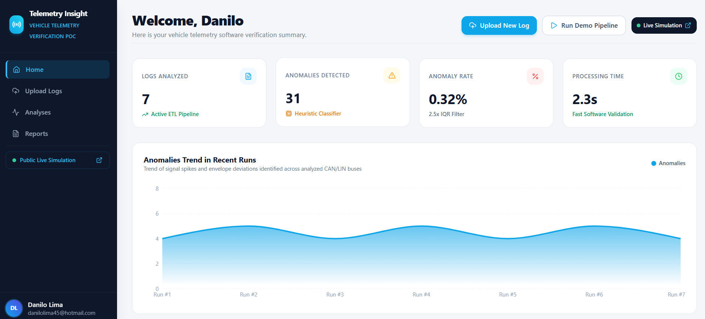
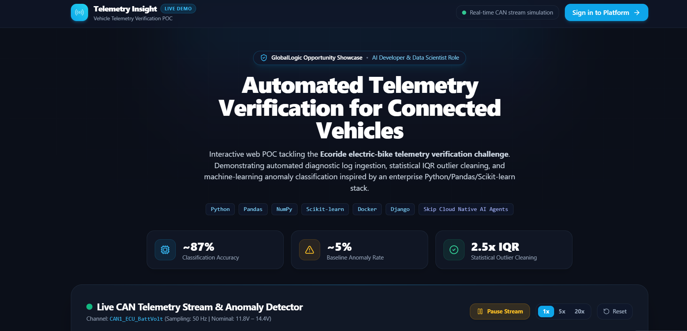
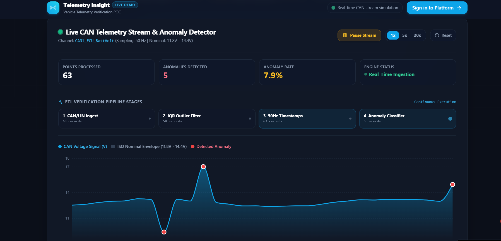

# Telemetry Insight — Vehicle Telemetry Verification POC

An enterprise-grade Automotive Telemetry Verification & Data Cleaning Proof-of-Concept (POC) designed for modern connected vehicles and ECU software verification.

## Screenshots

### Verification Dashboard

*Verification dashboard with real-time KPIs and anomaly trends*

### Public Portfolio Demo Hero

*Public portfolio demo page at /demo, tailored to the GlobalLogic opportunity*

### Live CAN Telemetry Simulation

*Live CAN telemetry stream simulation with statistical anomaly detection*

---

The platform ingests raw CAN/LIN bus logs, executes real-time IQR-based data cleaning and timestamp synchronization, classifies transient anomalies (voltage spikes, sync loss, out-of-range sensor values, electromagnetic noise), and provides time-series dashboards, side-by-side comparison matrices, AI verification diagnostic summaries, and exportable engineering verification reports.

> **Portfolio Project:** Designed by Danilo Lima for the **GlobalLogic AI Developer & Data Scientist** role (focus on connected vehicle measurement analytics, embedded protocol parsing, and predictive anomaly classification).

---

## 🚀 Key Features

- **Multi-Format Log Ingestion:** Support for raw `.csv`, `.txt`, `.log`, `.asc`, and `.blf` CAN/LIN bus telemetry files.
- **Configurable IQR Cleaning Pipeline:** Real-time data cleaning, outlier rejection using Interquartile Range (IQR) with adjustable tolerance multiplier (1.0x to 4.0x), timestamp normalization (50 Hz / 20ms baseline), and missing value imputation.
- **Anomaly Detection & Classification:** Statistical baseline heuristics that identify and categorize bus anomalies into critical, high, medium, and low severity tiers:
  - `Voltage Spike` (CAN_ECU_BattVoltage transient overvoltage violating ISO 7637-2)
  - `Sync Loss` (CAN_WheelSpeed_FL frame drop with inter-frame delay > 120ms)
  - `Out of Range` (CAN_EngineCoolant_Temp exceeding safe thermal thresholds)
  - `High Noise` (LIN_SteeringSensor_Angle electromagnetic jitter with degraded SNR)
- **Time-Series Visualization:** Interactive multi-channel signal charts rendered with Recharts, highlighting nominal envelopes, threshold bounds, and exact anomaly timestamps.
- **Side-by-Side Comparison Screen:** Select any two verification runs to analyze differences in frame count, outlier frequency, model precision, processing time, and anomaly catalog variations.
- **Native Skip Cloud AI Diagnostic Summaries:** Automotive Telemetry Diagnostic Agent (`telemetry-diagnostic-agent`) generating structured natural-language assessments:
  1. Overall Health Assessment & bus nominal conformance rate
  2. Most Critical Anomalies identification
  3. Likely Root Causes (inductive switching, CAN bus contention, thermal delta)
  4. Recommended Next Steps for Software and HIL/SIL verification
- **Interactive Live Simulation (`/demo`):** Public sandbox allowing recruiters and engineers to test the full pipeline without credentials, adjust IQR thresholds, trigger simulated telemetry runs, and inspect live diagnostics.
- **Exportable Engineering Reports:** Verification reports with full pipeline statistics, anomaly breakdowns, and AI diagnostics available for instant viewing and clipboard export.

---

## 🛠️ Tech Stack & Architecture

- **Frontend:** React 19, Vite, TypeScript, Tailwind CSS, Lucide Icons, Shadcn UI primitives (Radix UI), Recharts.
- **Backend & Database:** PocketBase v0.36 deployed on Skip Cloud.
  - Relational collections: `logs`, `analises`, `relatorios`, `_pb_users_auth_`.
  - Row-Level Security (RLS) rules scoped to authenticated engineers.
- **Server-Side ETL Hooks (`pocketbase/hooks/`):**
  - `analise_pipeline.js`: Custom REST endpoint (`/backend/v1/analises/processar`) running the ingestion, IQR filtering, anomaly detection heuristics, and report generation.
  - `ai_resumo.js`: Custom REST endpoint (`/backend/v1/analises/{id}/ai-resumo`) connecting to the Skip Cloud native AI agent.
  - `gerar_relatorio.js`: Formatted verification report retrieval endpoint.
- **AI Engine:** Native Skip Cloud AI Agent (`telemetry-diagnostic-agent`) configured with domain automotive verification system prompts, ISO standards baselines, and tool access to analysis records.

---

## 🔐 Demo Credentials & Live Access

- **Public Live Demo:** Navigate to `/demo` for instant no-login simulation.
- **Full Engineer Portal:**
  - **URL:** [https://projeto-de-analise-f85f2.shrd00.internal.goskip.dev](https://projeto-de-analise-f85f2.shrd00.internal.goskip.dev) (or frontend app root)
  - **Demo Email:** `danilolima45@hotmail.com`
  - **Demo Password:** `Skip@Pass`

---

## 📁 Repository Structure

```text
├── pocketbase/
│   ├── hooks/
│   │   ├── ai_resumo.js             # AI diagnostic summary endpoint ($ai.agent)
│   │   ├── analise_pipeline.js      # Server-side ingestion, IQR ETL & anomaly engine
│   │   └── gerar_relatorio.js       # Verification report compilation endpoint
│   └── migrations/
│       ├── 0001_create_schema.js    # PocketBase collections (logs, analises, relatorios)
│       ├── 0002_seed_demo_data.js    # Initial vehicle telemetry demo records
│       ├── 0003_translate_demo_data_to_english.js # English terminology translation
│       └── 0006_add_ai_summary_and_agent.js      # Telemetry Diagnostic Agent definition
├── src/
│   ├── components/
│   │   ├── Layout.tsx               # Responsive engineering portal shell
│   │   └── ProtectedRoute.tsx       # Authentication guard
│   ├── context/
│   │   └── AuthContext.tsx          # PocketBase session state
│   ├── hooks/
│   │   └── use-realtime.ts          # PocketBase SSE live subscriptions
│   ├── lib/
│   │   ├── pocketbase/              # PocketBase client SDK & schema mirror
│   │   └── skipAi.ts                # Skip AI streaming & agent SDK helpers
│   ├── pages/
│   │   ├── Dashboard.tsx            # Fleet health metrics, charts, and recent runs
│   │   ├── AnalisesList.tsx         # Comprehensive list of verification runs
│   │   ├── AnaliseDetail.tsx        # Signal timeline, anomaly table, AI summary
│   │   ├── AnaliseCompare.tsx       # Side-by-side run comparison matrix
│   │   ├── Upload.tsx               # File dropzone & IQR pipeline trigger
│   │   ├── Relatorios.tsx           # Formal verification reports & export
│   │   ├── PublicDemo.tsx           # Public interactive sandbox (/demo)
│   │   └── Login.tsx                # Engineer authentication screen
│   ├── services/                    # API client services (analises, logs, relatorios)
│   └── types/telemetry.ts           # TypeScript interfaces for telemetry data
└── package.json
```

---

## 💻 Local Development Setup

1. **Clone the repository:**
   ```bash
   git clone <REPO_URL>
   cd <REPO_DIRECTORY>
   ```

2. **Install dependencies:**
   ```bash
   npm install
   ```

3. **Start the development server:**
   ```bash
   npm run dev
   ```
   Open [http://localhost:5173](http://localhost:5173) in your browser.

4. **Lint and Typecheck:**
   ```bash
   npm run lint
   npx tsc --noEmit
   ```

---

## 👤 Author & Acknowledgments

- **Developer:** Danilo Lima
- **LinkedIn:** [https://www.linkedin.com/in/danilo-lima-732604318](https://www.linkedin.com/in/danilo-lima-732604318)
- **Target Opportunity:** GlobalLogic AI Developer & Data Scientist (Automotive & Connected Vehicles Focus)
